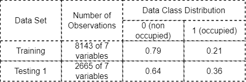
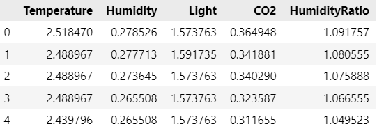
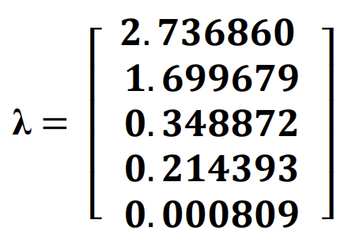
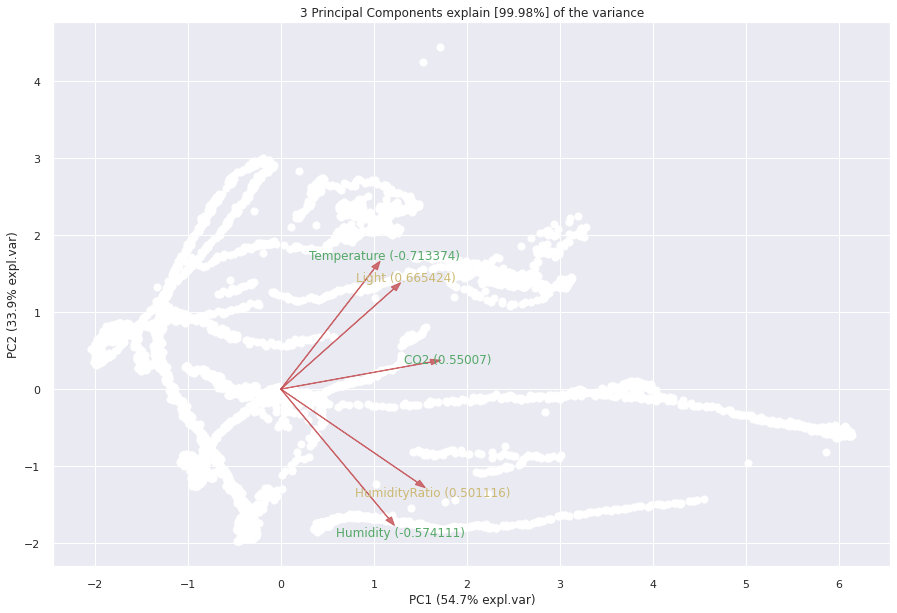
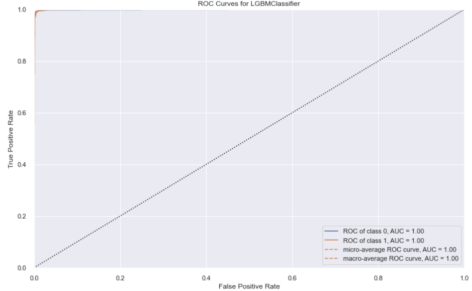

# PCA and Binary Classification on Office Room Occupancy
---------------------------------------------------------
---------------------------------------------------------
## Abstract:
> Principal Component Analysis (PCA) is a fast and flexible unsupervised dimensionality reduction method that transforms a high dimensional data with correlated features to low dimenesional data with uncorrelated features. This report illustrates the use of PCA when applied to the office room occupancy data set attributes and then classifying orthogonal data to check if the room is occupied. Determination of occupancy detection in a room can lead to considerable energy savings in modern smart home/buildings. Four classifiers: Decision Trees Classifier, Extra Trees Classifier, Random Forest Classifier, and Light Gadient Boosting Machines were picked with the help of PyCaret to use on data. The evaluation of models is done on basis of **~~Still some part remaining~~**. Extra Trees classifier performed the best on the data set. **~~Still some part remaining~~**

> Keywords- Principal Component Analysis (PCA), Binary Classification, Decision Trees Classifier, Extra Trees Classifier, Random Forest Classifier, Light Gadient Boosting Machines
---------------------------------------------------------
## Ⅰ. Introduction:

With the decreasing price of sensors and the availability of reasonable computational power for automation systems, determining occupancy is a very promising way to lowering energy usage in buildings through appropriate control of HVAC and lighting systems. Threat of climate adversity has made it important for the production of most energy efficient products [1]. The precise detection of occupancy in buildings has lately been projected to save energy in the range of 30 to 42 percent. When occupancy data was employed as an input for HVAC control algorithms, it resulted in energy savings of 37 percent withour sacrificing indoor climate and between 29 and 80 percent in another [2]. When privacy matters are considered, it makes much more sense to use sensors for getting accurate occupant numbers than to use cameras. Determining building inhabitants behavior and Security are another two applications for occupancy detection. 

The research [2] used data from light, temperature, humidity, and CO2 sensors to detect occupancy, as well as a digital camera to determine ground occupancy for data labelling. This data set created for occupancy detection is used for this study. 

Working with a huge dataset as what used in this study is usually perplexing and laborious. To make the research easier, the approach must incorporate dimension reduction, while preserving the majority of the data variability. PCA is generally used for such tasks [3], which is described and implemented in Section 3, after giving a brief Exploratory Data Anlaysis in Section 2. Section 4, throws light on applicable Classifiers with brief explanations and discussion of the most promising model that helps in detection for this process in Section 5. Section 6 closes with a summary of the findings.

---------------------------------------------------------
## Ⅱ. Exploratory Data Analysis:

Exploratory Data Analysis refers to the crucial process of conducting preliminary investigations on data in order to uncover patterns, spot anomalies, test hypotheses, and validate assumptions using summary statistics and graphical representations. Here it's done in three parts, first by giving a brief introduction for the raw data set, then discussing the cleaning process and description for used data set. At last, checking distribution and outliers with Box Plots and correlation of points with Correlation Matrix.

#### Raw Data Set Description

As mentioned in the study [2], the following variables were observed in an office space with approximate dimensions of 5.85m, 3.50m, 3.53m (W D H): timestamp, temperature, humidity, light, and CO2 levels. The study collects the data using a microcontroller. It was linked to a ZigBee radio, which was used to relay the data to a recording station. A digital camera was utilised to assess whether or not the room was inhabited. Every minute, the camera time stamped an image, which was then manually examined to identify the data. The humidity ratio is another additional variable in the data model, calculated as ( W = 0.622×(pw/(p-pw)) ).

The data was collected in February in Mons, Belgium, during the winter. The room was heated by hot water radiators, which kept the temperature above 19 degrees Celsius. The models are tested for data sets with the office door open and closed in order to estimate the difference in occupancy detection accuracy provided by the models. The measurements were obtained at 14-second intervals/3-4 times every minute, and then averaged for that minute.

#### Data Cleaning

All three data sets were missing column name for their first column, which was named as "id" and then dropped in data pre-processing. For the purpose of this study, only training data will be used. 

#### Used Data Set Description

The description for these two datasets is summarized in **Table 1**. No duplicate rows or NaN values were found for both of the datasets. And all the values are floating point numbers, except the column "Occupancy" which is labelled with int values, 0 and 1 

The distribution of class can be seen with the bar plot in **Figure 1**. As said, the label 1 represents that the room was occupied and Class 0 for unoccupied rooms.

#### Data Analysis

Standardization is put into use to adjust each input variable independently by removing the mean, and dividing by the standard deviation to shift the distribution to have a mean of zero and a standard deviation of one [4]. After standardization, the Descriptive Statistics metrics can be seen in **Table 2**. If it's not done, then covariances for larger number ranges will be much higher. 

Putting this standardize matrix in a Box Plot gives us the idea about the distribution of the data, measures of central tendency and spread. In **Figure 2**, we can see that, all the data attributes are positively skewed to an extent. Data is centered around 0, beacuse of standardization and variability is minimum for the same reason. Outliers are present for 3 of the 5 attributes and all of them are on the skewed side of whiskers.

To understand the relationship among the attributes, Correlation Matrix and Pair Plot are used. It's evident that almost all of the parameters are positively correlated with each others. There is no presence of any variable with negative correlation with all of the others variables. CO2 has significant correlation with rest of variables over others as seen in **Figure 3**

This can also be supported with the help of pairplot in **Figure 4**. The strong positve correlations are determined with increasing line. Whereas, weak correlations form clusters rather than an increasing line in pair plot. 

The multiple correlations among data set parameters, is the reason why PCA is implemented to get un-correlated data.

---------------------------------------------------------
## Ⅲ. Principal Component Analysis:

PCA is typically used to reduce the dimensionality of data while retaining as much of the information present in the original data as feasible. It does this by examining a data table including observations characterised by numerous dependent variables that are, in general, inter-correlated. Its purpose is to extract the key information from the data table and express this information as a set of new orthogonal variables known as principal components. Simply put, PCA is important so as to:

1. Extract the most relevant information from the data table, 
2. Compress the size of the data set by maintaining just the most significant information, 
3. Simplify the data set description, and 
4. Evaluate the structure of the observations and variables.

PCA output comprises of coefficients that specify the linear combinations used to obtain the new variables (PC loadings) as well as the new variables themselves (PCs). The first PC must have the greatest potential variance. The second component is calculated with the constraint of being orthogonal to the first component and having the greatest possible inertia. The other components are calculated in the same way. [6]

#### Steps for PCA algorithm:

We need to make sure, data should be structured in a typical matrix format, with n rows of samples and p columns of variables. There should be no missing values: each variable should have a value for each sample, which can be zero [7]. The steps needed for PCA is as follows [3].
1. Centering the dataset: For this step we substract the mean of a variable from all of its values, so that the data stays centered on the origin of main components, because any algorithm which is based on distance computations are affected a lot if the data used isn't normalized/centeralised [8]. 

Y = HX .......... (1)

For our study, standardisation is preferred over centering to avoid precision error when range of variables is different.

2. Calculate Covariance Matrix: Covariance matrix of size p×p is produced to check if data set has correlated features and also so as eigen decomposition can be applied to the data [3].

S = (1/n-1) × YT × Y .......... (2)

The study notebook doesn't include this as a step for PCA implementation, as PCA library directly outputs the PC scores.

3. Eigen Decomposition: Eigenvectors and eigenvalues are obtained from the Covariance matrix S with eigen dencomposition. Eigenvectors give direction of Principal Components with variance of PCs dented with eigenvalues and are given by [3]:

S = A×λ×AT .......... (3)

where A is a p×p orthogonal eigenvector matrix and is a diagonal eigenvalue matrix.

In our case, we have a 5×5 eigenvector matrix and a 1×5 column of eigenvalues, both given in **Figure 5** and **Figure 6** respectively.

4. Principal Components: The last step yields a n×p matrix Z, with its rows giving the observed values and columns representing the PCs. Given by equation [3]:

Z = Y×A .......... (4)

The variance of jth PC is given as following [3]:

 .......... (5)

where λj gives the variance of jth PC. Both Scree/Elbow plots can be used to get an idea of how many PCs are needed to represent the variance present in the data. In this study, we found out that variance accounted for first PC is l1 = 54.7% and by 2nd PC it is l2 = 33.9% and that by 3rd PC is l3 = 6.97%. The elbow joint in the scree plot, shows a bend at PC number 3, that is also supported with Pareto Chart. So, it's safe to assume that dimensions of eigenvector or Z components can be reduced to 3.

The **Table 6** table gives a subset of the PCs, 8143×5 as 8143×3 because first 3 PCs explain 99.98% of the whole variance of dataset. The first PC component Z1 is given by [3]:

  

Z1 = 0.55007×X4 + 0.501116×X5 + 0.414149×X3 + 0.395664×X2 + 0.343856×X1

X4 (CO2), X5 (Humidity Ratio), X3 (Light), X2 (Humidity), and X1 (Temperature), contribute most to the 1st PC, respectively. For Z2, we got = 

- 0.574111×X2 + 0.535864×X1 + 0.444612×X3 - 0.413692×X5  + 0.120106×X4

For both of the first two principal components we don't have any attribiute contributing negligibly to them. But in case of, third principal component, X2 doesn't affect it that much, so effective PC will be:

Z3 = - 0.713374×X1 + 0.665424×X3 - 0.189517×X5 + 0.110938×X4   

This same could be verified with the help of PC coefficient Plot as in **Figure 10**. Temperature and Humidity lies in the lower range for the first PC, along with CO2 and Humidity Ration being the most important factors for consideration, with light being somewhere in the middle of first two and latter two. Whereas, all the bottom 3 contributors of 1st PC got to be at the top for 2nd PC and C02 being the least.

BiPlot gives the same information as of **Figure 10**. The angles between the vectors (rows of eigenvector matrix) and axes (representing the first two PCs) gives the contribution of variables to PCs [3], i.e., the vector with smallest angle with the axe contributes most to that axe/PC. Also, each observation is scattered as a point in the plot.

This same could be represented for three PCs with help of 3d BiPlot as shown in **Figure 12**.

---------------------------------------------------------
## Ⅳ. Classification Algorithms:

Classification assigns a label value to a given class and then determines if a specific type is of one kind or another [9]. It can be used with both unstructured and structured data. It’s a supervised learning concept and basically categorizes data into classes [10]. So, depending upon the data, it can either be  binary classification or a multi-class classification. Classification algorithms works in a lot of different ways, primarily Logic based, Perceptron based, Statistic techniques, Support Vector Machines, and others. Making a choice among these, is inconclusive as it depends to a great extent on usage and attributes/properties of data [11]. So, to make the process easier for this study, the choice is made with help of PyCaret. This could be seen in **Figure 13**. Generally, The Receiver Operating Characteristics (ROC) curve, which illustrates the connection between the true positive rate and the false positive rate, is used for visual comparison of classification models. The area under the ROC curve represents the model's accuracy [10].   

For testing purposes, the training data was split into 70-30 ratio. From **Figure 13**, it's obvious that the best model is Extra Trees Classifier. Three other models were chosen, on basis of there evaluation scores being close to the best model, those are: Decision Trees Classifier, Random Forest Classifier, and Light Gradient Boosting Machine Classifier. Tuning was done with the help of PyCaret too, so no hyperparameter selection for best model performance was explicitly done in this report [12].

1. Descision Trees Classifier:

Decision Tree is a supervised learning approach that may be used to solve both classification and regression problems, however it is most commonly employed to solve classification issues. Internal nodes contain dataset attributes, branches represent decision rules, and each leaf node provides the conclusion in this tree-structured classifier. The Decision Node and the Leaf Node are the two nodes of a Decision tree. Leaf nodes are the result of those decisions and do not include any more branches, whereas Choice nodes are used to make any decision and have several branches. The judgments or tests are made based on the characteristics of the provided dataset. It's a graphical depiction for obtaining all feasible answers to a problem/decision depending on certain parameters. It's termed a decision tree because, like a tree, it starts with the root node and grows into a tree-like structure with additional branches. We utilise the CART algorithm, which stands for Classification and Regression Tree algorithm, to form a tree. A decision tree simply asks a question and divides the tree into subtrees based on the answer (Yes/No) [13].

The procedure for determining the class of a given dataset in a decision tree starts at the root node of the tree. This algorithm checks the values of the root property with the values of the record (actual dataset) attribute and then follows the branch and jumps to the next node depending on the comparison. The algorithm checks the attribute value with the other sub-nodes and moves on to the next node. It repeats the process until it reaches the tree's leaf node. The algorithm below might help you understand the entire procedure [13]:

1. Start with the root node, which includes the whole dataset, says S.
2. Using the Attribute Selection Measure, find the best attribute in the dataset (ASM).
3. Subdivide the S into subsets that include the best attribute's potential values.
4. Create the node of the decision tree that has the best attribute.
5. Create new decision trees in a recursive manner using the subsets of the dataset created in step 3. Continue this procedure until the nodes can no longer be classified, at which point the final node is referred to as a leaf node.

2. Random Forest Classifier:

Random forests, also known as random choice forests, are an ensemble learning approach for classification, regression, and other problems that works by generating a large number of decision trees during training. The decision forest is often trained using the "bagging" approach. The bagging approach is based on the premise that combining learning models improves the final output [14]. For classification problems, the random forest output is the class chosen by the majority of trees. [15] [16].

Deep-grown trees, in particular, tend to acquire very irregular patterns: they overfit their training sets, resulting in low bias but very high variance. Random forests are a method of averaging numerous deep decision trees that have been trained on various regions of the same training set in order to reduce variance [17]. This results in a minor increase in bias and some loss of interpretability, but it considerably enhances the final model's performance.

The hyperparameters of random forest are nearly equivalent to those of decision trees and bagging classifiers. Random Forest adds more randomness to the model as it grows the trees. When dividing a node, the best feature from a random collection of qualities is chosen rather than the most important trait. As a result, there is a large range of variability, resulting in a better model overall. As a result, the random forest strategy for dividing a node examines just a random subset of the features. You may even make trees more random by using random thresholds for each feature rather than searching for the best possible thresholds [14].

3. Extra Trees Classifier:

To get its classification result, Extra Trees Classifier(Extremely Randomized Trees Classifier) is a form of ensemble learning technique that aggregates the outcomes of several de-correlated decision trees collected in a "forest." It is conceptually identical to a Random Forest Classifier, with the exception of how the decision trees in the forest are constructed [18].

The Extra Trees Forest's Decision Trees are all made from the original training sample. Then, at each test node, each tree is given a random sample of k features from the feature set, from which it must choose the best feature to split the data according to certain mathematical criteria (typically the Gini Index). Multiple de-correlated decision trees are created from this random sample of features [18].

The Extra Trees Classifier is less computationally costly than a Random Forest since splits are picked at random for each feature. However, Decision Trees have a high variance, Random Forests have a medium variance, and Extra Trees have a low variance [19].

During the construction of the forest, the normalised total reduction in the mathematical criteria used in the decision of feature of split (Gini Index if the Gini Index is used in the construction of the forest) is computed for each feature to perform feature selection using the above forest structure. This value is called the Gini Importance of the feature. To execute feature selection, each feature is ranked in descending order by Gini Importance, and the user selects the top k features based on his or her preferences [18].

4. Light Gradient Boosting Machine Classifier:

Gradient boosting is a type of machine learning method that may be used to solve classification or regression predictive modelling challenges. Decision tree models are used to create ensembles. To repair the prediction mistakes caused by past models, trees are introduced to the ensemble one at a time and fitted. The boosting model is a sort of ensemble machine learning model. Models are fitted using a gradient descent optimization approach and any arbitrary differentiable loss function. Gradient boosting gets its name from the fact that the loss gradient is reduced when the model is fitted, much like a neural network [20].

LightGBM improves on the gradient boosting technique by using a sort of autonomous feature selection and focuses on boosting cases with greater gradients. This can result in a significant increase in training speed and enhanced prediction performance. The implementation presents two major concepts: EFB and GOSS [20].

1. Gradient-based One-Side Sampling, or GOSS for short, is a gradient boosting technique modification that concentrates emphasis on training samples that result in a bigger gradient, hence speeding up learning and decreasing the approach's computing cost.

2. Exclusive Feature Bundling, or EFB, is a method for grouping mutually incompatible characteristics that are sparse (mainly zero), such as categorical variable inputs that have been one-hot encoded. As such, it falls under the category of automated feature selection.

It splits the tree leaf-wise with the greatest fit since it is based on decision tree algorithms, unlike other boosting methods split the tree depth-wise or level-wise rather than leaf-wise. So, while growing on the same leaf in Light GBM, the leaf-wise approach may minimise more loss than the level-wise technique, resulting in considerably superior accuracy than any of the existing boosting algorithms can seldom accomplish. It is also astonishingly quick, thus the name 'Light' [21].

The **Figure 20** and **Figure 21** discusses this difference.

---------------------------------------------------------
## Ⅴ. Classification vs Classification+PCA Results:

---------------------------------------------------------
## Ⅵ. Conclusions:

---------------------------------------------------------
## Ⅶ. References:

[1] Boardman, B. (2004). New Directions for Household Energy Efficiency: Evidence from the UK. Energy Policy, 32(17), 1921–1933. https://doi.org/10.1016/j.enpol.2004.03.021 

[2] Candanedo Ibarra, Luis & Feldheim, Veronique. (2015). Accurate occupancy detection of an office room from light, temperature, humidity and CO2 measurements using statistical learning models. Energy and Buildings. 112. 10.1016/j.enbuild.2015.11.071.

[3] A. Ben Hamza, Advanced Statistical Approaches to Quality, unpublished.

[4] https://scikit-learn.org/stable/modules/generated/sklearn.preprocessing.StandardScaler.html

[5] https://godzillabutnicer.com/the-why-of-principal-component-analysis-standardization-covariance/

[6] Principal Component Analysis Herv´e Abdi · Lynne J. Williams

[7] https://strata.uga.edu/8370/lecturenotes/principalComponents.html

[8] https://datafai.com/2017/10/27/data-standardization-or-normalization/

[9] https://www.analyticsvidhya.com/blog/2021/09/a-complete-guide-to-understand-classification-in-machine-learning/

[10] https://www.edureka.co/blog/classification-in-machine-learning/#:~:text=In%20machine%20learning%2C%20classification%20is,recognition%2C%20document%20classification%2C%20etc.

[11] Kotsiantis, Sotiris & Zaharakis, I. & Pintelas, P.. (2006). Machine learning: A review of classification and combining techniques. Artificial Intelligence Review. 26. 159-190. 10.1007/s10462-007-9052-3.

[12] https://pycaret.gitbook.io/docs/get-started/release-notes#tune_model-1

[13] https://www.javatpoint.com/machine-learning-decision-tree-classification-algorithm

[14] https://builtin.com/data-science/random-forest-algorithm

[15] Ho, Tin Kam (1995). Random Decision Forests (PDF). Proceedings of the 3rd International Conference on Document Analysis and Recognition, Montreal, QC, 14–16 August 1995. pp. 278–282. Archived from the original (PDF) on 17 April 2016. Retrieved 5 June 2016.

[16] Ho TK (1998). "The Random Subspace Method for Constructing Decision Forests" (PDF). IEEE Transactions on Pattern Analysis and Machine Intelligence. 20 (8): 832–844. doi:10.1109/34.709601.

[17] Hastie, Trevor; Tibshirani, Robert; Friedman, Jerome (2008). The Elements of Statistical Learning (2nd ed.). Springer. ISBN 0-387-95284-5. 

[18] https://www.geeksforgeeks.org/ml-extra-tree-classifier-for-feature-selection/

[19] https://towardsdatascience.com/an-intuitive-explanation-of-random-forest-and-extra-trees-classifiers-8507ac21d54b

[20] https://machinelearningmastery.com/light-gradient-boosted-machine-lightgbm-ensemble/

[21] https://www.analyticsvidhya.com/blog/2017/06/which-algorithm-takes-the-crown-light-gbm-vs-xgboost/
 

---------------------------------------------------------
---------------------------------------------------------
---------------------------------------------------------
## Ⅸ. Abstract:
>
---------------------------------------------------------
## Ⅹ. Abstract:
>
---------------------------------------------------------

